# TaskMaster (HTML + Tailwind CSS 4.1 + JavaScript)

[](#)

Este proyecto es un gestor de tareas moderno y didáctico que demuestra tres formas de trabajar con datos en el navegador, ahora con interfaz basada en **Tailwind CSS 4.1** sin frameworks de JavaScript ni Node:

- Local (sin red): usando `localStorage` con API asíncrona simulada.
- Fetch API: pidiendo datos a un endpoint público (JSONPlaceholder).
- AJAX clásico (XMLHttpRequest): la forma tradicional previa a Fetch.

La aplicación está pensada para que un alumno pueda leer el código y entender el “por qué” de cada decisión. Incluye documentación en todos los archivos y comentarios JSDoc en la lógica JavaScript.

---

## Estructura del proyecto

```
TaskMaster/
├─ index.html                # Estructura semántica, Tailwind CSS 4.1 (CDN) y puntos de montaje
└─ js/
   ├─ api.js                 # Capa de datos (localStorage, Fetch, XHR)
   ├─ taskManager.js         # Lógica de negocio y render de UI (Tailwind utilities)
   └─ app.js                 # Arranque de la aplicación
```

---

## Filosofía y separación de responsabilidades (con Tailwind)

- `index.html`
  - Define la estructura semántica (header, main, lista de tareas) y una barra de demostración (sembrar datos por Fetch/XHR y vaciar).
  - Carga scripts “clásicos” en orden: primero la capa de datos (`api.js`), luego la lógica (`taskManager.js`) y, por último, el arranque (`app.js`).
  - ¿Por qué clásico y no ES Modules? Al abrir por `file://`, los navegadores pueden bloquear módulos ES por CORS. Evitamos servidores externos para mantener la consigna “solo HTML/CSS/JS”.

- `css/styles.css`
  - Usa variables CSS (paleta, bordes, sombras, transiciones) y un modo oscuro controlado por `[data-theme="dark"]`.
  - Estilo minimalista: preferimos bordes sutiles y buen contraste, con atención a accesibilidad (`:focus-visible`).
  - Incluye un overlay de carga con spinner para las demostraciones Fetch/XHR.

- `js/api.js`
  - Encapsula todo el acceso a datos con una API asíncrona: obtener, guardar, añadir, actualizar y eliminar tareas.
  - Simula latencia de red para acostumbrar a trabajar con `async/await` y posibles retardos.
  - Expone métodos de “semilla” para traer datos de ejemplo de un endpoint público con `fetch()` o con `XMLHttpRequest`.
  - Se publica una instancia global `window.taskAPI` para scripts clásicos.

- `js/taskManager.js`
  - Clase `TaskManager` que gestiona estado, eventos y render del DOM.
  - Renderiza la lista con **utilidades Tailwind** (flex, gap, rounded, bg, border, dark:, etc.).
  - Notificaciones con clases Tailwind y transiciones (translate-y, opacity).
  - Overlay con `hidden`/`flex` y `animate-spin`.
  - Tema con clase `dark` en `<html>`, preferencia persistida en `localStorage`.
  - Filtros con alternancia de clases `bg-primary`/`text-white` vs transparente.
  - Se publica la clase como `window.TaskManager`.

- `js/app.js`
  - Punto de entrada: espera a `DOMContentLoaded`, crea una instancia de `TaskManager` y la expone en `window.taskManager` para depurar.

---

## Cómo ejecutar

1. Abre `index.html` con doble clic (se abrirá con `file://`).
   - Requiere Internet para cargar los CDNs de Tailwind CSS y Font Awesome.
   - Si no hay Internet, la app funciona pero los estilos de Tailwind no se aplicarán.
2. Añade tareas, márcalas como completadas, edítalas o elimínalas.
3. Prueba la barra de demostración:
   - Elige la “Cantidad” (3/5/10).
   - Pulsa “Sembrar (Fetch)” o “Sembrar (XHR)”. Si hay Internet y CORS permitido (JSONPlaceholder normalmente lo permite), se cargarán tareas de ejemplo.
   - “Vaciar todo” borra todas las tareas en `localStorage`.

Notas:
- Todo persiste en `localStorage` del navegador, por lo que al recargar seguirás viendo tus tareas.
- Si Fetch/XHR falla (sin red o bloqueo), la app sigue funcionando con los datos locales.

---

## Conceptos clave (para alumnos)

- Asincronía: Todos los métodos de la “API” son `async` y devuelven `Promise`, para reflejar el mundo real (servidores que tardan en responder). Esto te obliga a usar `await` y a manejar errores.
- Diseño en capas: Separar **vista** (HTML/CSS), **lógica** (TaskManager) y **datos** (API) facilita pruebas, mantenimiento y escalabilidad.
- Accesibilidad: se respetan estados de foco, hay etiquetas `aria-label` en controles, y se evita inyectar HTML no escapado (`escapeHtml`).
- Persistencia local: `localStorage` permite guardar el estado sin servidores.
- Compatibilidad: evitar ES Modules en `file://` evita errores CORS y hace que el proyecto funcione “al abrir y listo”.

---

## Flujo principal

1. `app.js` crea `new window.TaskManager()` cuando el DOM está listo.
2. `TaskManager.init()` carga tareas desde `taskAPI.getTasks()`, dibuja la lista y configura los eventos.
3. Al añadir/editar/completar/eliminar, `TaskManager` llama a `taskAPI` y luego vuelve a renderizar.
4. La barra de demo puede “sembrar” con `Fetch` o `XHR`, y muestra un overlay de carga durante la operación.

---

## Diagramas de secuencia

### 1) CRUD de tareas

#### 1.1 Añadir una tarea (localStorage)
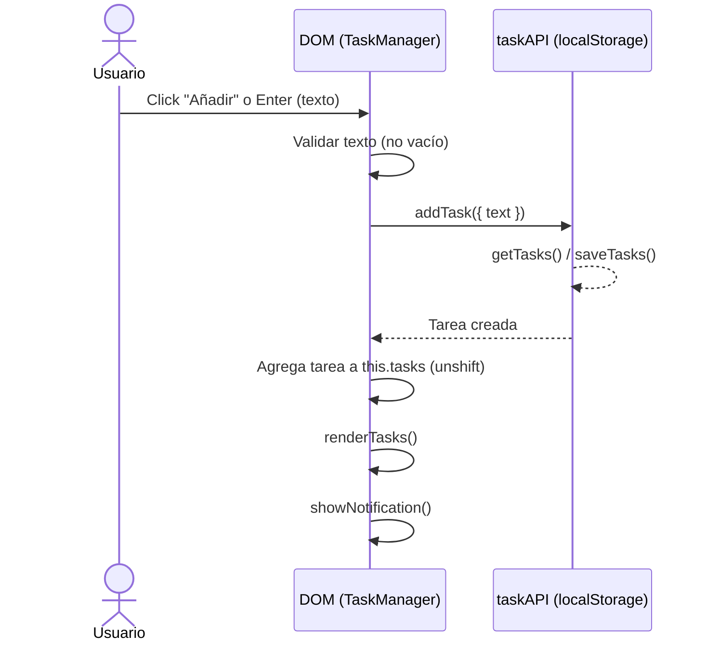

#### 1.2 Cambiar estado completado/pendiente
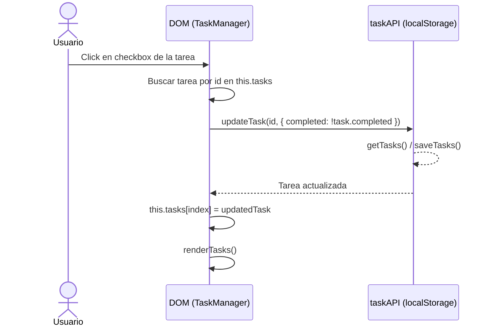

#### 1.3 Edición inline de una tarea (texto)
```mermaid
sequenceDiagram
    actor U as Usuario
    participant UI as DOM (TaskManager)
    participant API as taskAPI (localStorage)

    U->>UI: Click botón "Editar"
    UI->>UI: Reemplazar <span> por <input> y enfocar
    alt Guardar (Enter o blur)
        UI->>UI: newText = input.value.trim()
        UI->>API: updateTask(id, { text: newText })
        API-->>API: getTasks() / saveTasks()
        API-->>UI: Tarea actualizada
        UI->>UI: this.tasks[index] = updatedTask
        UI->>UI: renderTasks()
        UI->>UI: showNotification()
    else Cancelar (Escape) o sin cambios
        UI->>UI: renderTasks() (restaurar vista)
    end
```

#### 1.4 Eliminar una tarea
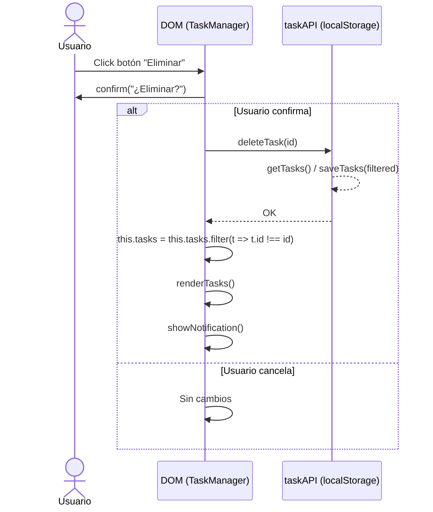

### 2) Filtrado por estado
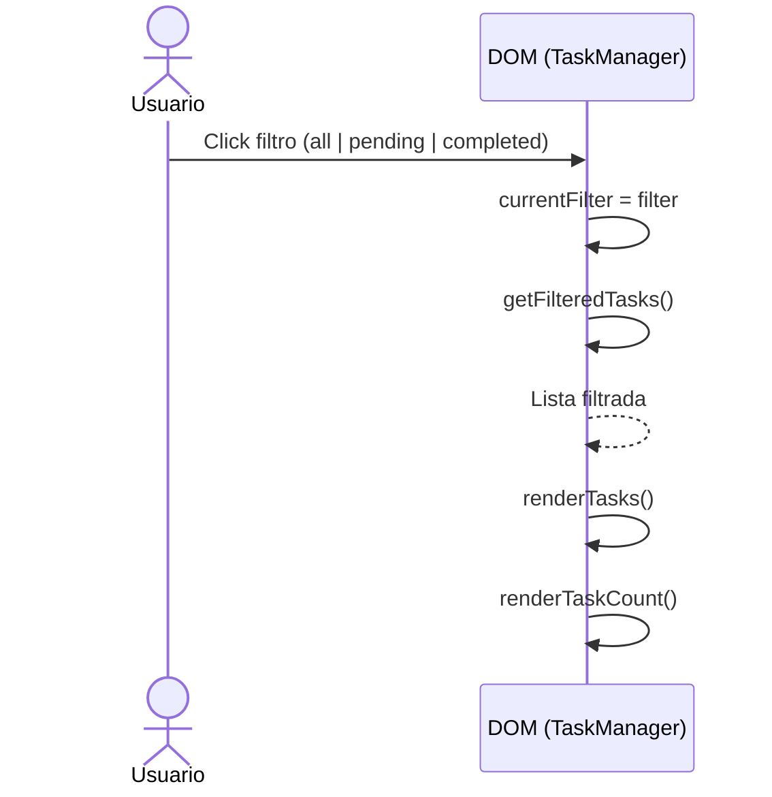

### 3) Operaciones masivas

#### 3.1 Limpiar tareas completadas
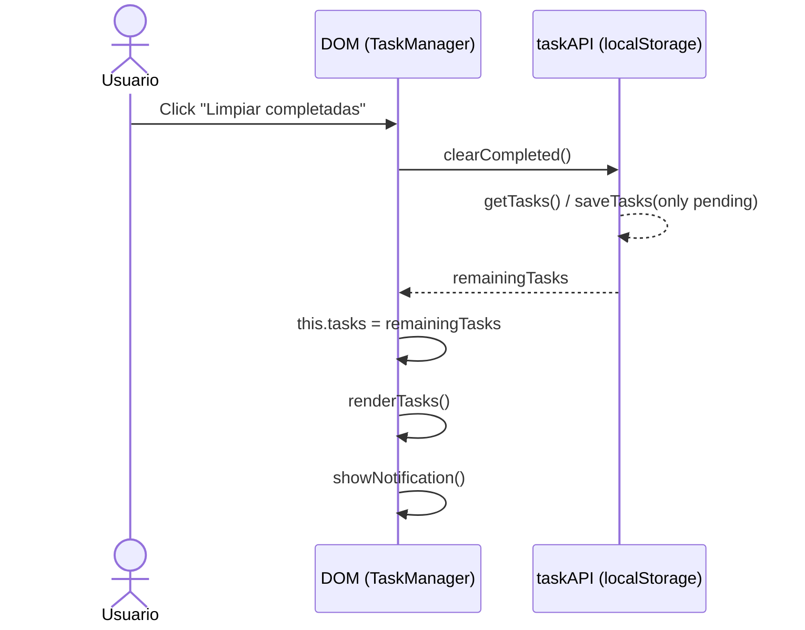

#### 3.2 Vaciar todas las tareas (barra de demostración)
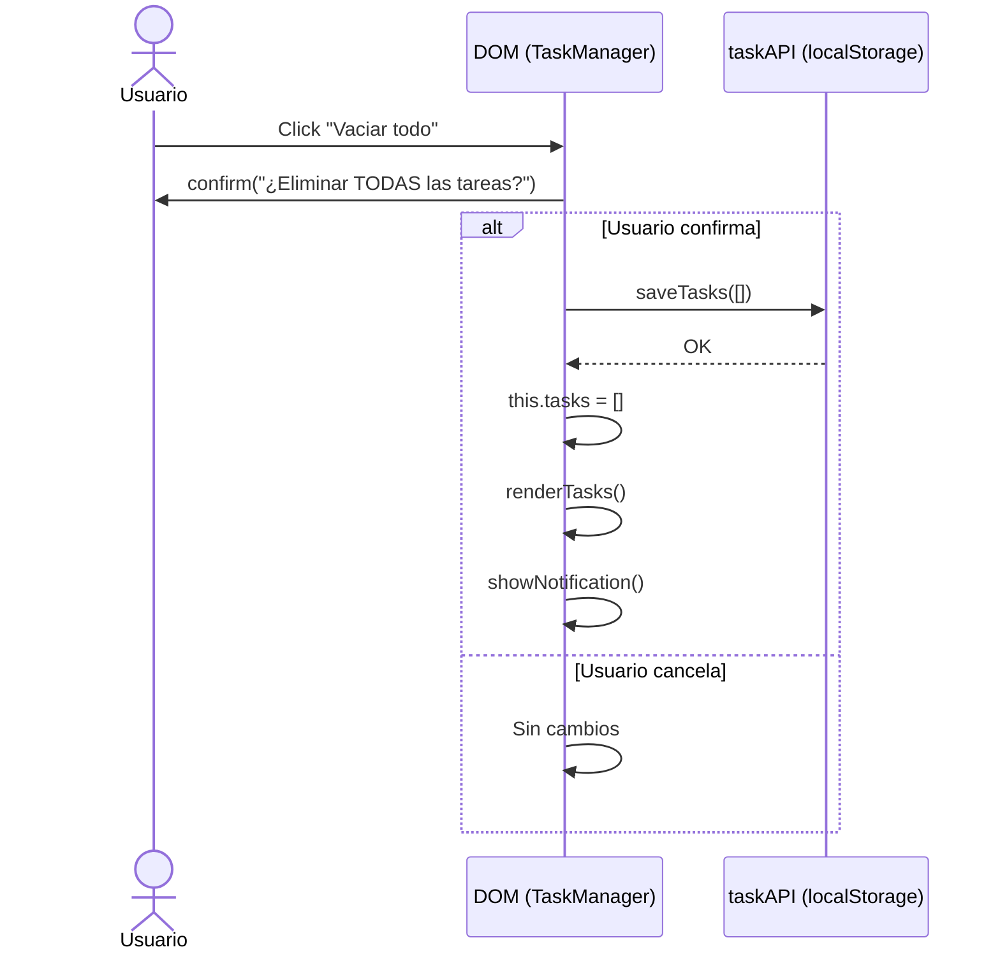

#### 3.3 Completar todas las tareas (opcional)
Nota: Método disponible en taskAPI.completeAll(); no existe botón en la UI por defecto.
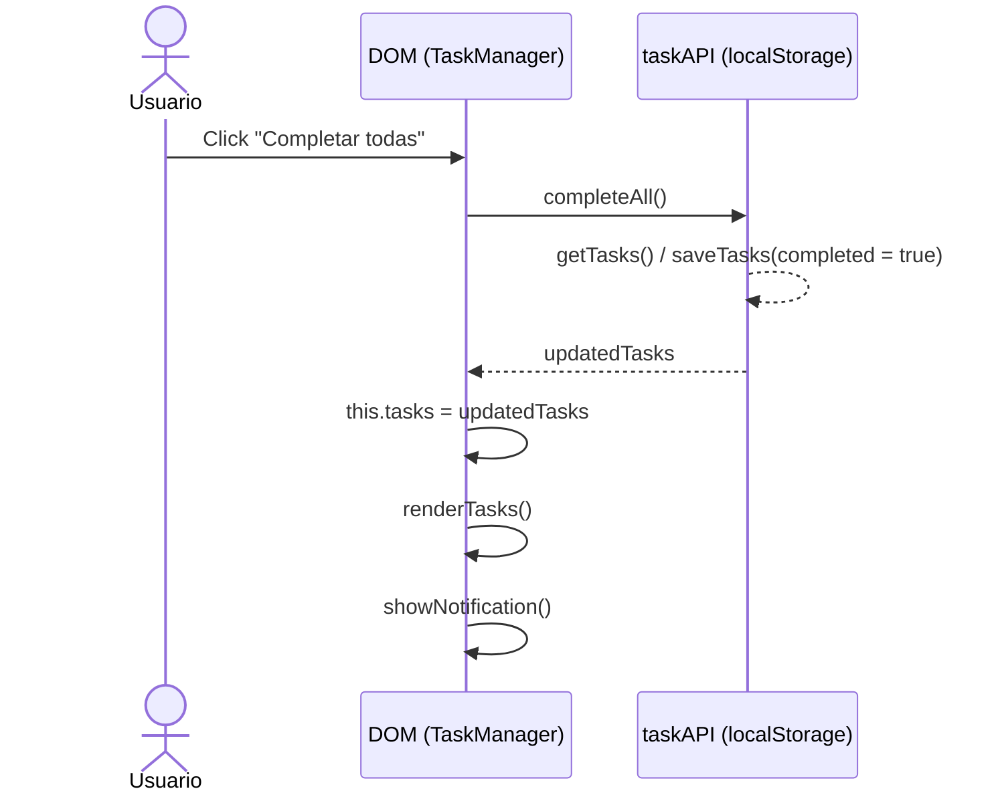

### 4) Demostración: Sembrar con Fetch o XHR
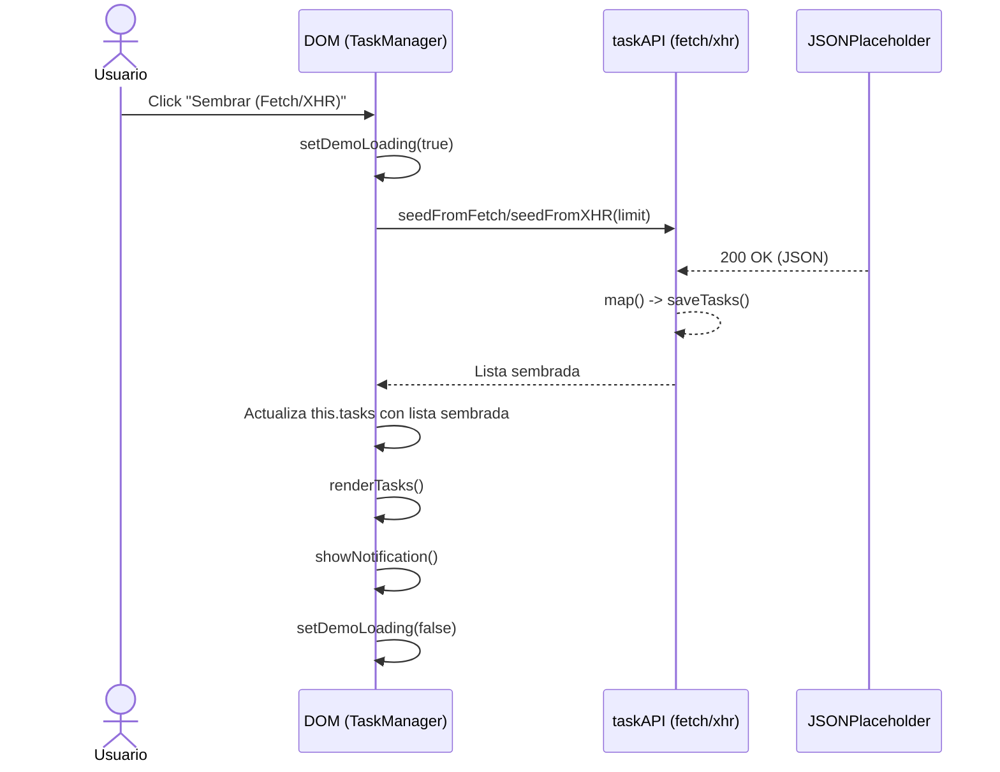
- `seedFromFetch(limit)` → `Promise<array>` (requiere red)
- `seedFromXHR(limit)` → `Promise<array>` (requiere red)

### 5) Auxiliares

#### 5.1 Diagrama de estados de una tarea
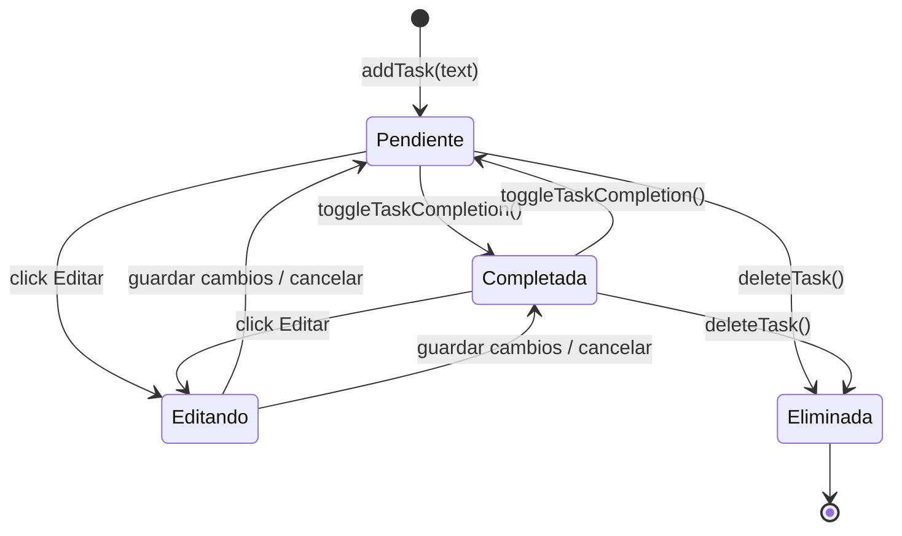

#### 5.2 Diagrama de clases (simplificado)
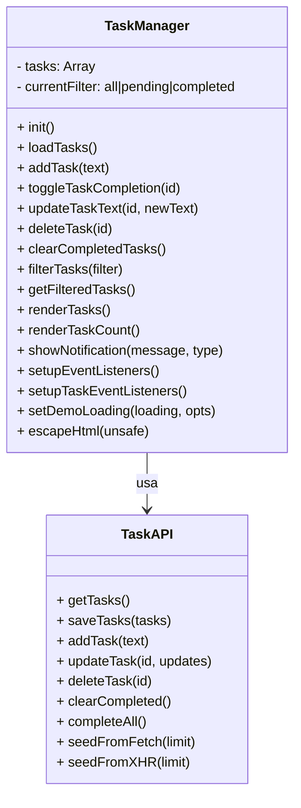

#### 5.3 Mapa de eventos de UI (resumen)
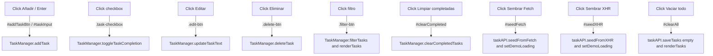

## Buenas prácticas visibles en el código

- Escapado de HTML en `TaskManager.escapeHtml()`.
- Estados de carga y deshabilitado de controles en operaciones asíncronas.
- Contador de tareas y filtros que no dependen de cómo llegan los datos.
- Notificaciones con **utilidades Tailwind** (bg-green-500/bg-red-500, transiciones).
- Modo claro/oscuro con clase `dark` en `<html>`.
- Comentarios JSDoc y de secciones que explican el "por qué".
- **Uso de `const` en lugar de `let`/`var`** para variables que no cambian de valor.

---

## ideas de ejercicios guiados

{{ ... }}
  - Objetivo: Añadir un campo `priority` (low|medium|high) y un selector al crear/editar.
  - Pistas: Extiende el objeto de tarea en `api.js` y ajusta el render en `taskManager.js`. Usa clases CSS para colorear etiquetas.

- Búsqueda por texto
  - Objetivo: Filtrar tareas en tiempo real por coincidencia parcial en `text`.
  - Pistas: Añade un input de búsqueda y filtra sobre `this.tasks` antes de `renderTasks()`.

- Exportar/Importar JSON
  - Objetivo: Permitir descargar las tareas como `.json` y volver a cargarlas.
  - Pistas: `JSON.stringify(this.tasks)` + `URL.createObjectURL(new Blob(...))` para exportar; `FileReader` para importar y luego `taskAPI.saveTasks()`.

- Confirmación visual de eliminación
  - Objetivo: Reemplazar `confirm()` por un toast/dialog no bloqueante.
  - Pistas: Crea un mini componente con HTML/CSS, y resuelve la promesa cuando el usuario confirma/cancela.

- Tests (si usas un entorno con Node)
  - Objetivo: Añadir unit tests a `TaskManager` (métodos puros) y pruebas de interacción DOM.
    - Pistas: `jest` + `@testing-library/dom` o Playwright para flujos E2E.

---

## Glosario (para alumnos)

- Asincronía: Operaciones que tardan (red, disco) sin bloquear la UI. En JS se maneja con Promesas y async/await.
- Promise: Objeto que representa el resultado futuro de una operación asincrónica (éxito o error).
- DOM: Representación del documento HTML como árbol de nodos; permite manipular la interfaz desde JS.
- CORS: Política que regula el acceso entre orígenes distintos; en file:// los navegadores restringen módulos y lecturas locales.
- Fetch API: Interfaz moderna para peticiones HTTP basada en Promesas.
- XMLHttpRequest (XHR): API clásica de AJAX previa a Fetch, basada en eventos/callbacks.
- localStorage: Almacenamiento clave-valor persistente en el navegador; útil para demos sin servidor.
- ARIA: Atributos de accesibilidad para mejorar la experiencia con tecnologías de asistencia (ej. aria-label).
- :focus-visible: Pseudoclase CSS que muestra el foco al navegar con teclado sin molestar al uso con mouse.


- Fetch/XHR fallan (sin red o endpoint caído)
  - Síntoma: Notificación de error al “Sembrar”.
  - Verifica: Conexión a Internet, consola del navegador, endpoint accesible.
  - Alternativa: La app sigue funcionando con `localStorage` sin sembrar.

- No persisten las tareas
  - Síntoma: Al recargar, desaparecen las tareas.
  - Causa: el navegador puede estar en modo incógnito bloqueando `localStorage`.
  - Solución: Usar ventana normal o permitir almacenamiento local.

- Overlay no se muestra
  - Síntoma: No ves el spinner durante Fetch/XHR.
  - Causa: El overlay usa utilidades `hidden`/`flex` de Tailwind y requiere que el CDN esté cargado.
  - Solución: Revisa `setDemoLoading()` en `taskManager.js` y que el CDN de Tailwind cargue correctamente.

- Estilos no se aplican
  - Síntoma: La app se ve sin estilos o con HTML plano.
  - Causa: Falta del CDN de Tailwind CSS o sin conexión a Internet.
  - Solución: Verifica el `<script>` de Tailwind en `index.html` y tu conexión.

---

## Tema claro/oscuro

- El switch en el header controla la clase `dark` sobre `<html>`.
- Se persiste en `localStorage` como `theme = 'light' | 'dark'`.
- Si no hay preferencia guardada, respeta `prefers-color-scheme` del sistema.

---

## Utilidades Tailwind CSS más usadas en el proyecto

### Layout y Espaciado
- **flex**: contenedor flexible para layouts
- **gap-{n}**: espaciado entre elementos flex (gap-2, gap-3, gap-4)
- **p-{n}**, **px-{n}**, **py-{n}**: padding (p-4, px-6, py-3)
- **m-{n}**, **mb-{n}**: margin (mb-3, mb-6)
- **space-y-{n}**: espacio vertical entre hijos (space-y-3)

### Colores y Tema
- **bg-{color}-{shade}**: colores de fondo (bg-white, bg-gray-50, bg-primary)
- **text-{color}-{shade}**: colores de texto (text-gray-900, text-primary)
- **dark:{utility}**: variantes para modo oscuro (dark:bg-gray-900, dark:text-gray-100)
- **border-{color}-{shade}**: colores de borde (border-gray-200, dark:border-gray-700)

### Bordes y Redondeo
- **rounded-{size}**: bordes redondeados (rounded-lg, rounded-full)
- **border**: borde de 1px
- **border-{side}**: borde en lado específico (border-b)

### Transiciones y Animaciones
- **transition**: transición suave de propiedades
- **duration-{ms}**: duración de transición (duration-200, duration-300)
- **animate-spin**: rotación continua (spinner)
- **animate-[fadeIn_0.3s_ease-out]**: animación personalizada

### Estados Interactivos
- **hover:{utility}**: estilos al pasar el mouse (hover:bg-gray-100, hover:text-primary)
- **focus:{utility}**: estilos al enfocar (focus:outline-none, focus:ring-2)
- **peer**: marca elemento para estados peer-*
- **peer-checked:{utility}**: estilos cuando peer está checked

### Posicionamiento
- **fixed**: posición fija
- **absolute**: posición absoluta
- **relative**: posición relativa
- **inset-0**: top/right/bottom/left = 0
- **z-{n}**: índice z (z-50)

### Visibilidad y Display
- **hidden**: display: none
- **flex**: display: flex
- **opacity-{n}**: opacidad (opacity-0, opacity-50, opacity-70, opacity-100)
- **sr-only**: oculto visualmente pero accesible

### Transformaciones
- **translate-{axis}-{n}**: traslación (translate-y-32, translate-x-6)
- **transform**: habilita transformaciones

---

## Changelog

- **v3 (Tailwind CSS 4.1)**
  - Migración completa de CSS puro a **Tailwind CSS 4.1** (CDN Play).
  - Utilidades de diseño: flex, gap, rounded, bg, border, dark:, transitions.
  - Notificaciones con clases Tailwind (bg-green-500/bg-red-500, translate-y, opacity).
  - Overlay con `hidden`/`flex` y `animate-spin`.
  - Tema con clase `dark` en `<html>` y persistencia en `localStorage`.
  - **Eliminada carpeta `css/`**: Sin archivos CSS personalizados, 100% Tailwind.
  - Documentación completa con comentarios profesionales en HTML y JS.
